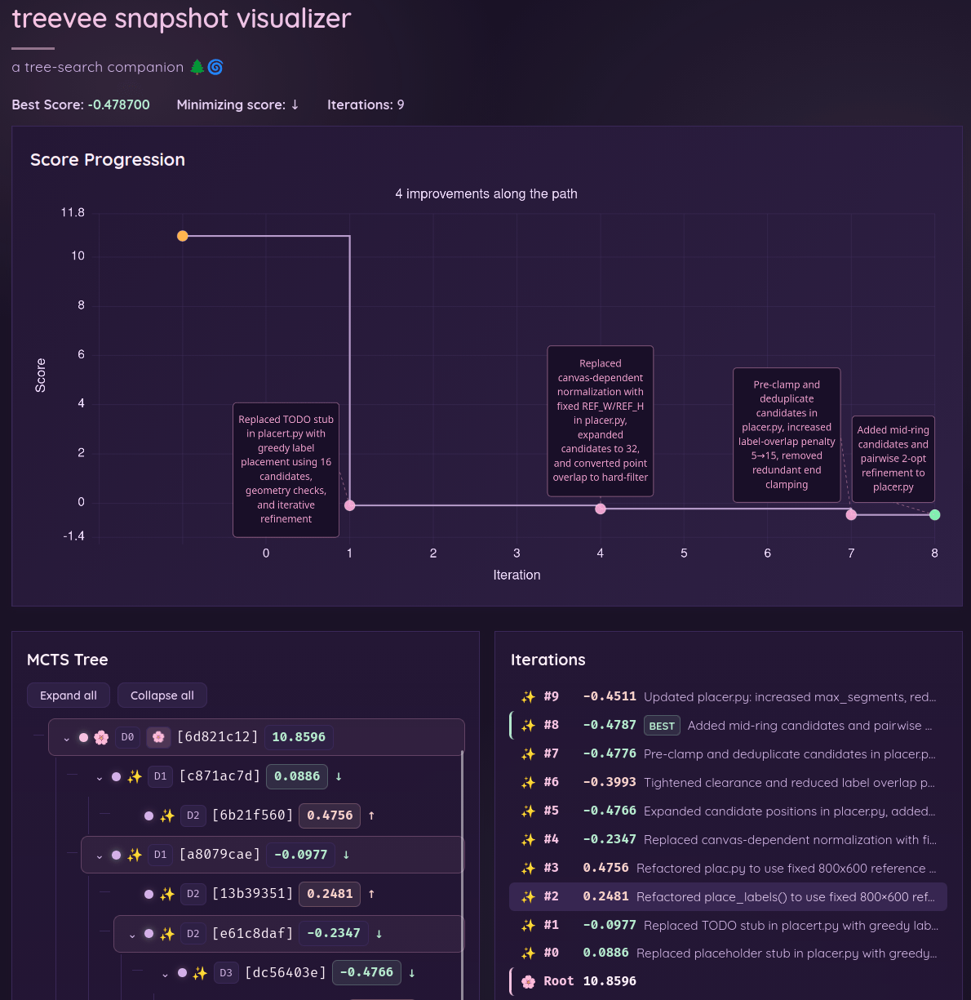

# treevee 

Optimize anything with a scoring function, tree search, and large language models. 




## How it works

Given a scoring function, a task description, and code to modify, treevee will conduct a tree search over possible solutions to improve the score. At each step, it will generate a new solution by asking large language models (LLM) to propose changes and implement them.

More specifically, the flow is as follows:
1. Pick a node from the tree
2. Ask a planner LLM to provide suggestions to improve the node, debug it, or run fusion between nodes
3. Run editor LLM to implement the suggestions
4. Run the evaluation command to compute the score
5. Repeat

This is not a new idea. The treevee code leans heavily on the [MLEvolve](https://github.com/InternScience/MLEvolve) implementation in particular. Some other interesting references are [AIDE ML](https://github.com/WecoAI/aideml) or the [AI scientist paper](https://arxiv.org/abs/2509.06503) from Google Research. 

Combining LLM mutations with tree search and a concrete score function makes them more robust to failures and allows for iterative exploration of a solution space. 

## Table of Contents
- [How it works](#how-it-works)
- [Why treevee?](#why-treevee)
- [Installation](#installation)
- [Project structure](#project-structure)
- [Example workflow](#example-workflow)
- [Commands](#commands)
- [Safety](#safety)
- [Questions](#questions)

## Why treevee? 

I couldn't fully wrap my mind around MLEvolve or AIDE ML, so I made my own thing. 

Some opinionated differences relative to other frameworks:
- clear input project structure
- planner / editor separation
- only one iteration running at a time
- properly sandboxed (see safety section)
- using claude code as the harness
- support various LLM APIs (see provider config below) 

## Installation

You can install with `uv` using: `uv tool install git+https://github.com/lambdaloop/treevee/`

## Project structure

```
my_project/
├── experiment/   # folder with code/params the LLM edits
├── eval.py       # default eval script 
├── pixi.toml     # default environment for running eval.py
├── TASK.md       # describes the task and objective
└── config.toml   # optional, see config.example.toml
```

By default it runs `pixi run python eval.py` and expects it to print something like `{"score": <float>, "description": "more detailed metrics as string"}`
in the last line to stdout. Any other output is allowed, just make sure the very last line is structured like that!
You can configure the eval command in the config.toml with the `eval_cmd` parameter.

You can have any other files in the `my_project` folder, the LLM will edit only the `experiment/` subfolder.

One nice structure that I use is having a separate `code/` subfolder for my codebase, and then symlink the relevant files from `experiment/` to `code/` so the structure is maintained for my project.

## Example workflow

Here is an example workflow that I've used, here specifically for the [label placement example](./examples/label_placement).

1. Create a new folder
2. Run `treevee init` within the folder to populate the structure
3. Modify the `eval.py` script and initial `experiment` folder for your task 
4. You can place any other files in the folder. Only files in `experiment` are modified, but other files may be read.
5. Update the `config.toml` file to match your task design

For step 3, I prompted claude code to generate a label placement evaluation task that penalizes overlap of label boxes with lines, points, and other labels, as well as penalizes clipping, distance of label from point, and inconsistent positions when canvas changes. Prompting to generate a task generally works well enough, but you may have to tune the score function a bit to make sure the weights are what you want. 

5. Run `treevee run` within the folder 
6. Marvel at the score improving over time in the webapp (default url is http://localhost:9000 )


## Commands

- `treevee run` — run the optimization loop on a project directory
- `treevee viz` — start the web visualization server to inspect the search tree
- `treevee init` — scaffold a new project with starter config, TASK.md, and eval.py
- `treevee restore` — restore the codebase from a snapshot (best, root, or specific node)
- `treevee tree` — print a tree summary of the run with scores and edit summaries
- `treevee history` — print iterations in chronological order with scores and edit summaries

## Safety

Some mechanisms to prevent the LLM loop from going wild:
- planner only has read and web search access
- editor can only edit the experiment/ subfolder
- neither planner nor editor can run bash scripts
- the evaluation command is run in a sandbox using bubblewrap so it can only edit files in project folder

## Questions

### Can I disable the sandbox? 

I see you like to live on the wild side. Yes, you can pass `--disable-sandbox` to `treevee run` to disable the sandbox. I recommend running this in a docker container for safety in that case.

### What's up with the name? 

It's tree + eevee! It seemed like a cool name for an evolutionary tree algorithm search program.

### How actively maintained will this be?

I'm not sure yet, the project is still quite new.  

### What have you used this for? 

I was really happy that it could optimize the [core bundle adjustment loop in aniposelib](https://github.com/lambdaloop/aniposelib/commit/4e9cff938d7ae253443a6bf8d7ca1538108089c2) with this! 

Besides that, I optimized the placement of the improvement labels in the treevee webapp graph (see header), as tuning the algorithm turned out to be harder than I thought at first.

